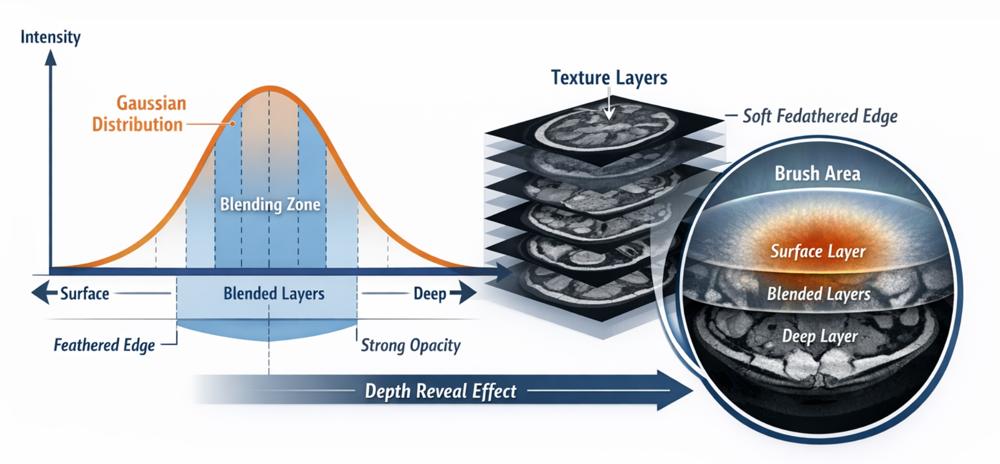

# human_visualization

Visualization of human slices

# Interactive Volume Slicer (ModernGL) — MPR Plane UI + Heap/Brush Reveal + 3D Gizmo

This project turns a stack of 2D medical slices into an interactive **3D volume viewer** with:

- **MPR plane slicing** (free-rotating plane through the volume)
- **Heap/brush reveal** (mouse-controlled depth reveal across a texture array)
- A **3D gizmo / view cube** (click X/Y/Z for axis planes, click 1–6 faces to snap camera + plane)
- Smooth navigation: rotate / pan / zoom / move plane through the volume

The volume data used in my workflow comes from the **Visible Human Project** PNG slices (abdomen/fullbody stacks), but the pipeline works for any consistent slice folder.

# Process

I first wanted to figure out how to take all the parsed images visualize moving in one dimension(x,y,z) along the slices, and applying a heap map

 

I then built my own thresholding tool using openCV to save different threshold setting to then create masks and clipped images.

## Demo Videos

  
 

    

## Features

### 1) MPR Plane UI (full-screen slice)

- A single plane (center + orientation + scale) samples the 3D volume.
- The plane can rotate freely (yaw/pitch) and pan in its own U/V directions.
- Sampling blends between adjacent Z layers for smooth reslicing.

### 2) Heap / Brush Reveal (texture-array compositing)

- Loads N slices into a `sampler2DArray`.
- Mouse position sets a circular “brush”.
- Brush center shows _deeper_ layers; outside stays at the surface layer.
- Optional blending between layers vs. discrete layer stepping.

### 3) 3D Gizmo / View Cube

- Top-right 3D cube shows the volume bounds.
- Plane is rendered as a **3D slab** (extruded plane) rather than a flat “compressed texture”.
- Click:
  - **X / Y / Z** → snap the slicing plane normal to axis-aligned orientations
  - **1–6** → snap to cube faces (±X ±Y ±Z), like Unity view cube
  - Cube faces also support direct snapping by clicking the cube

## Resources / References

- **Visible Human Project (NLM/NIH)**
  - Project overview: [NLM Visible Human Project](https://www.nlm.nih.gov/research/visible/visible_human.html)
  - Getting the data: [Visible Human — Getting the Data](https://www.nlm.nih.gov/research/visible/getting_data.html)

- **ModernGL**
  - Docs: [ModernGL Documentation](https://moderngl.readthedocs.io/en/latest/)
  - GitHub: [moderngl/moderngl](https://github.com/moderngl/moderngl)

- **moderngl-window**
  - Docs: [moderngl-window Documentation](https://moderngl-window.readthedocs.io/)
  - GitHub: [moderngl/moderngl-window](https://github.com/moderngl/moderngl-window)
